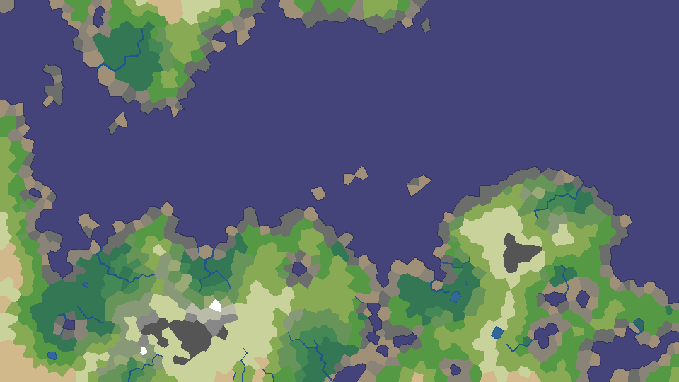
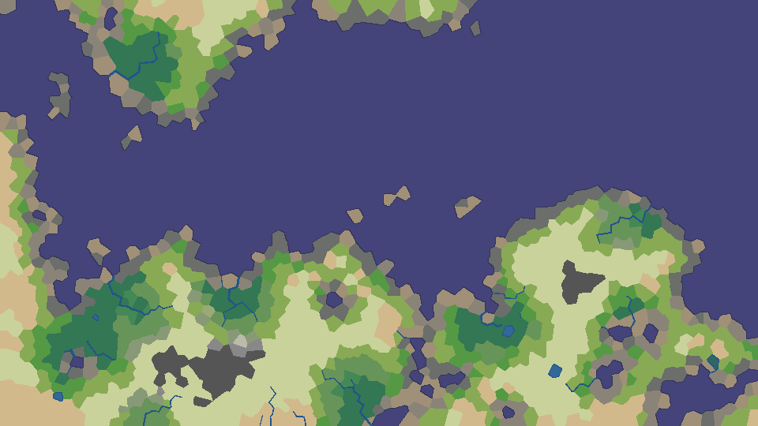
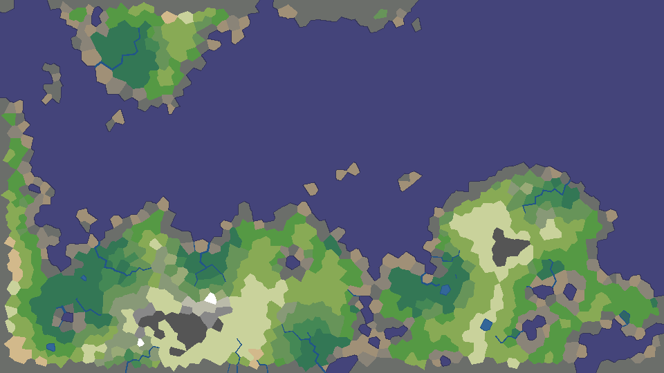
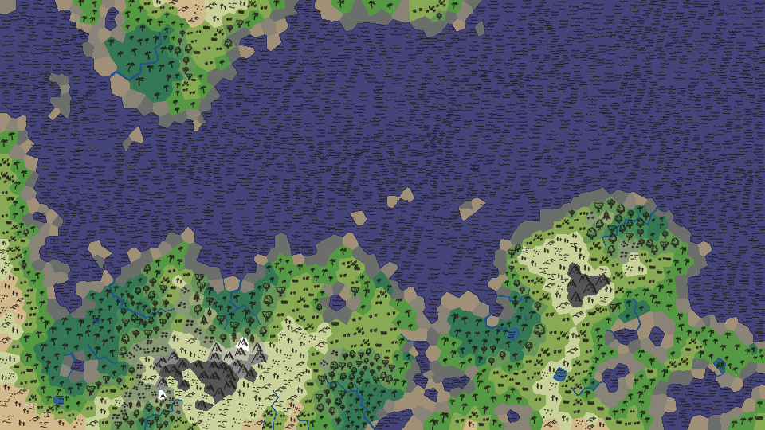
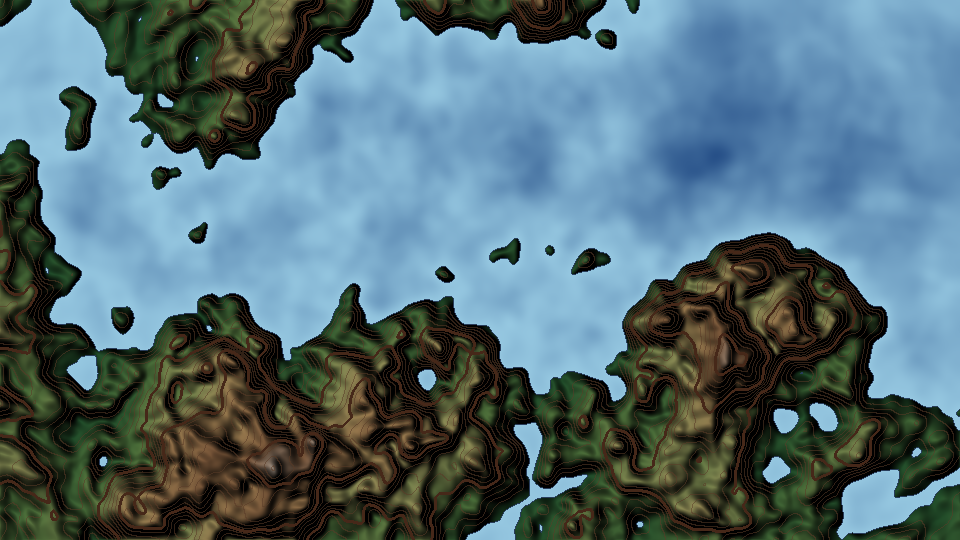
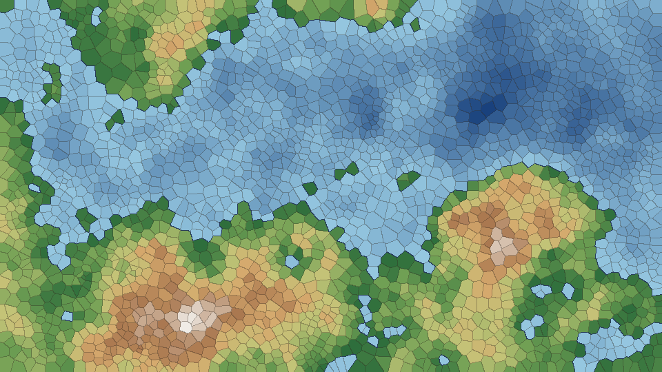
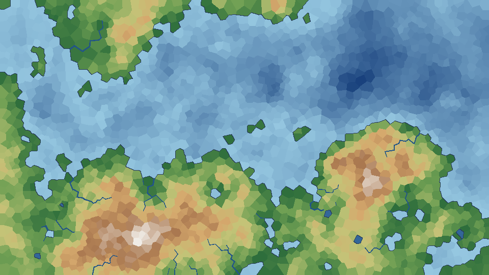

# wg



A fantasy map generator for gamemasters. `wg` grows a height map, lays a
Voronoi mesh of cells over it, and works out lakes, rivers, moisture and
biomes. It writes the result as PNG images.

The cells are the point. Each cell is a place on the map: a hex for travel,
a region to name, a site for a town or a quest. Ask for the number of land
cells you want and `wg` sizes the map to fit. A cell is about 14 pixels
across by default, and a render of any part of the map can be enlarged
without the cells changing.

## Install

You need Go 1.26 or later.

```sh
go install github.com/maloquacious/wg/cmd/wg@latest
```

Or, from a clone of this repository:

```sh
go run ./cmd/wg -h
```

## Usage

```sh
wg [flags]
```

`wg` prints a short summary and writes `<out>/<name>-<render>.png` for each
render you ask for. The same flags always make the same map.

### Examples

Make a map with the defaults and write its biome map to `map-biomes.png`:

```sh
wg
```

Ask for about 10,000 land cells and let `wg` choose the map size, keeping the
default 16:9 shape:

```sh
wg -land-cells 10000
```

The same, but square, with half the map ocean:

```sh
wg -land-cells 10000 -width 1000 -height 1000 -ocean 50
```

Try different worlds by changing the seed:

```sh
wg -seed 42
wg -seed 0xfeedface
```

Write every render into `maps/`, named `coast-topo.png`, `coast-biomes.png`
and so on:

```sh
wg -render all -out maps -name coast
```

A large map with rough terrain, and the share of each biome:

```sh
wg -width 2000 -height 2000 -rounds 10000 -ocean 52 -stats
```

An arid world, where the land between the rivers is desert:

```sh
wg -skew 2
```



A wet world:

```sh
wg -skew 0.5
```

Wall the map in: land that reaches the edge of the map ends in cliffs.

```sh
wg -border-cliffs
```



Draw Red Blob Games' hand-drawn icons in the biomes image: waves, mountains,
trees, grass, cacti and reeds. Which drawing each cell gets follows the seed.

```sh
wg -icons
```



Show the cells, for example to check their size before choosing a map:

```sh
wg -render biomes,mesh -borders
```

### Renders

| Render     | Shows |
|------------|-------|
| `topo`     | The height map as a shaded topographic map, with contours. |
| `mesh`     | The cells, tinted by elevation and ocean depth. |
| `terrain`  | Lakes and the direction water flows from every corner. |
| `rivers`   | Rivers, wider as they carry more water, and lakes. |
| `moisture` | How wet the land is, from desert tan to rain-forest green. |
| `biomes`   | The biome of every cell, with rivers. This is the default. |

Pass several as a comma list (`-render topo,biomes`), or `all` or `none`.

The pictures in this README are all one small map, 960 by 540 pixels with
about 1,270 land cells, made with:

```sh
wg -width 960 -height 540 -ocean 52 -render topo,rivers,biomes -out docs -name example
wg -width 960 -height 540 -ocean 52 -render mesh -borders -out docs -name example
wg -width 960 -height 540 -ocean 52 -skew 2 -render biomes -out docs -name arid
wg -width 960 -height 540 -ocean 52 -border-cliffs -render biomes -out docs -name walled
wg -width 960 -height 540 -ocean 52 -icons -render biomes -out docs -name icons
```

| `topo` | `mesh -borders` |
|--------|-----------------|
|  |  |
| **`rivers`** | **`biomes`** |
|  |  |

### Flags

| Flag | Default | What it does |
|------|---------|--------------|
| `-seed` | `0x0123456789abcdef` | Seed for the random stages. Decimal or `0x` hex. |
| `-width`, `-height` | `1920`, `1080` | Map size in pixels. With `-land-cells`, only their ratio is used. |
| `-land-cells` | off | Target number of land cells. Sets the map size. |
| `-rounds` | `1000` | Rounds of terrain building. More rounds give rougher terrain. |
| `-cell-size` | `14` | Mean width of a cell in pixels. |
| `-ocean` | `70` | Percentage of cells that are ocean. |
| `-lake-depth` | `0.01` | How deep a hollow must be to fill with a lake. |
| `-min-flow` | `2000` | Land area, in square pixels, a stream must drain to be a river. |
| `-spread` | `100` | Distance in pixels over which wetness from water fades. |
| `-sea` | `2` | How much the sea wets the coast. A lake is 1; 0 turns it off. |
| `-skew` | `1` | Above 1 makes an arid world, below 1 a wet one. |
| `-rocky` | `0.04` | Coast higher than this is rocky shore rather than beach. |
| `-cliff` | `0.01` | Rocky shore steeper than this is cliff. |
| `-border-cliffs` | off | Turn all land touching the edge of the map into cliff. |
| `-render` | `biomes` | Images to write. |
| `-icons` | off | Draw a hand-drawn icon in each cell of the `biomes` image. |
| `-borders` | off | Outline every cell in the `mesh`, `terrain`, `rivers` and `biomes` images. |
| `-out` | `.` | Directory for the images. |
| `-name` | `map` | File name prefix. |
| `-stats` | off | Print how many cells each biome has. |
| `-version` | | Print the version and exit. |

`wg -h` lists the flags with their current defaults.

## How it works

Each stage is a Go package, run in this order:

1. **`fracture`** builds the height map. Each round raises or lowers a random
   circle of the map.
2. **`voronoi`** covers the map with cells and gives each the mean height of
   the pixels in it. The lowest cells become ocean.
3. **`terrain`** fills hollows so that all water drains to the sea or off the
   edge of the map. Deep hollows become lakes.
4. **`rivers`** rains on the land and follows the water downhill. Streams
   that drain enough land become rivers.
5. **`moisture`** makes land wetter near rivers, lakes and the sea.
6. **`biomes`** chooses each cell's biome from its height and moisture: from
   tropical rain forest to snow, with beaches, rocky shores and cliffs on the
   coast.

The packages can be used on their own. Each has an `Options` type, a
`DefaultOptions` function and a `Generate` function that gives the same
result for the same input.

## Credits

- The stages after the height map follow Amit Patel's
  [Polygonal Map Generation for Games](http://www-cs-students.stanford.edu/~amitp/game-programming/polygon-map-generation/)
  and its mapgen2 code, with changes: elevation comes from the height map,
  rivers form wherever enough rain collects, the sea wets the coast, and the
  coast can be rocky or cliff as well as beach.
- The height map is adapted from `pkg/generators/flat` in
  [mdhender/mapgen](https://github.com/mdhender/mapgen).
- The topographic render follows the recipe in
  [mdhender/vetopo](https://github.com/mdhender/vetopo).
- Biome colors are from Red Blob Games' mapgen2 palette, Copyright 2017 Red
  Blob Games, under the Apache License 2.0. See `resources/`.
- The map icons that `-icons` draws, `resources/map-icons.svg`, are by
  [Red Blob Games](https://www.redblobgames.com/maps/mapgen2/map-icons.html),
  under the Creative Commons Attribution 4.0 International License. Credit
  Red Blob Games when you share a map drawn with them.

## License

MIT. See [LICENSE](LICENSE).
